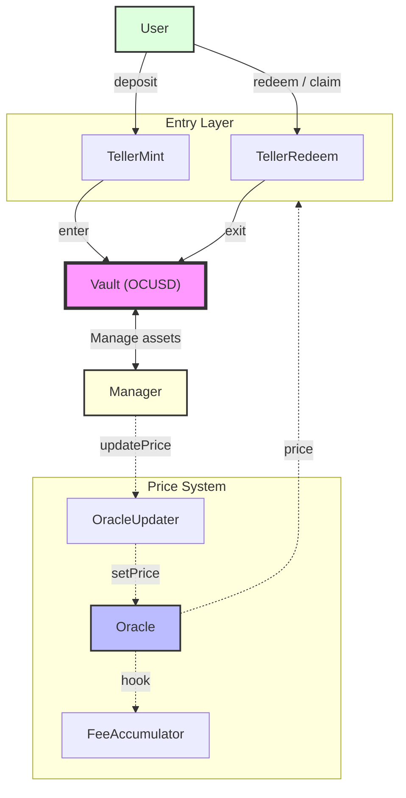

# Vault Architecture

## System Overview

The Solen Defi Vault System implements a yield-bearing stablecoin vault with modular architecture for asset management, price discovery, and fee accumulation. The system uses a separation of concerns pattern with dedicated contracts for minting, redemption, and oracle management.

> 📋 See [Contract Addresses](../contracts) for deployed contract addresses.

## Core Components

**Manager** - Deploys funds, ensures redemption liquidity, and updates prices

**Vault.sol** - ERC20 token representing user shares. Handles minting/burning when users deposit/withdraw, with transfer hook and multi-token support

**TellerMint.sol** - User deposit entry point. Calculates shares based on oracle prices, applies fees, and calls vault to mint shares

**TellerRedeem.sol** - Redemption manager with cooldown period. Users request redemptions, then claim after cooldown expires

**Oracle.sol** - Price feed with 8 decimal precision. Is pausable to stop minting/redeeming and triggers fee accumulation on updates

**OracleUpdater.sol** - Safety wrapper validating price updates against max APR changes. Auto-pauses on suspicious movements, to allow for manual intervention

**FeeAccumulator.sol** - Tracks management fees (time-based) and performance fees (above highwater mark). Updates on oracle price changes

**AuthorityEnumerable.sol** - Permission management extending Solmate's Authority with enumeration capability

### Architecture Diagram

## Key Operations

1. **Deposit**: User → TellerMint → Vault (mints OCUSD shares)
2. **Redeem Request**: User → TellerRedeem (locks OCUSD, starts cooldown)
3. **Claim**: User → TellerRedeem → Vault (burns OCUSD, returns USDT)
4. **Price Update**: Manager → OracleUpdater → Oracle → FeeAccumulator
5. **Asset Deployment**: Manager → Vault → External Protocols
6. **Fee Collection**: FeeAccumulator → Vault (USDT) → Manager
7. **Emergency Pause**: Manager → Oracle (halts minting/redeeming)
8. **Permissions**: Admin → AuthorityEnumerable → All Contracts

## Design Patterns

The vault combines battle-tested patterns from BoringVault and USDX. The vault core is forked from BoringVault, while the separate minting and redeem contracts follow USDX patterns.

### 1. Modular Upgradability

Swaps contracts instead of using proxies:

- No proxy complexity or storage collision risks
- Immutable core (Vault) with upgradeable periphery (Tellers)
- Users always interact with the same OCUSD token address

### 2. USDX-Style Tellers

Separates user operations from vault logic:

- **TellerMint**: Deposit entry point
- **TellerRedeem**: Exit with cooldown mechanism
- **Vault**: Immutable core, only accessible via Tellers

### 3. Hook-Based Fees

Oracle triggers FeeAccumulator on price updates:

- Time-based management fees
- Performance fees above highwater mark
- Extensible without vault changes

### 4. Enumerable Authority

Solmate's Authority with enumeration for permission auditing and fine-grained access control.

### 5. Safety Wrapper (OracleUpdater)

Bounds price updates to maximum APR to prevent manipulation.

### 6. Redemption Queue

Orderly withdrawals with cooldown:

- Users queue redemptions (OCUSD locked)
- Anyone can trigger claim after cooldown
- Predictable liquidity requirements

### 7. Multi-Asset Ready

While USDT-only now, supports future expansion:

- Multiple deposit assets
- Cross-asset redemptions
- Asset-specific Teller logic

## Configuration Parameters

**Fee Parameters**

- **Management Fee**: Annual fee on total assets (basis points)
- **Performance Fee**: Fee on profits above highwater mark (basis points)

**Oracle Parameters**

- **Max APR Update**: Maximum price change per update

**Deposit/Redemption Parameters**

- **Fee**: Transaction fee (basis points)
- **Min/Max Amount**: Deposit/redemption limits (USDT/OCUSD)
- **Cooldown**: Redemption delay before claims
