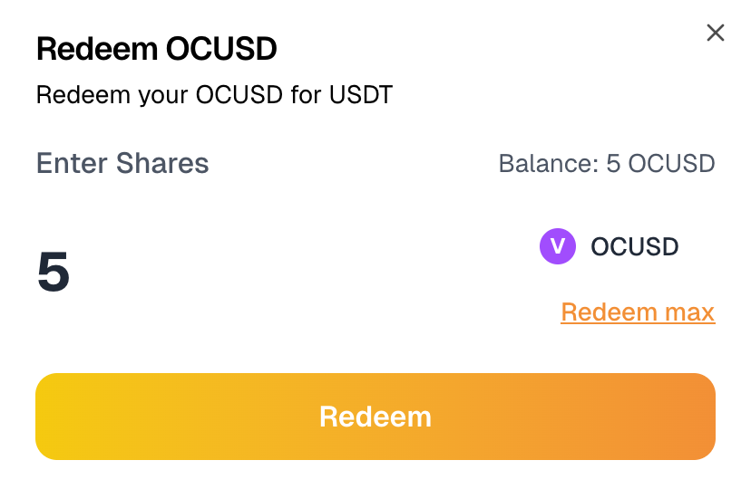

# USDT Vault – EDUChain

## Overview

The **USDT Vault** is a passive yield product by Solen Finance on EDUChain. Users deposit USDT and receive **OCUSD**, a yield-bearing stablecoin that appreciates over time based on real stablecoin yield strategies. All operations are handled by the Solen team, and users earn without needing to manage strategies themselves.

---

## How It Works

1. **Deposit USDT on EDUChain**
   - Users deposit USDT into the vault via the Solen frontend.
   - In return, they receive OCUSD, a token that represents their share in the vault.

2. **Yield Strategies Managed by Solen**
   - Solen deploys the USDT into stablecoin yield strategies on Arbitrum One.
   - Yield is harvested and bridged back to EDUChain to grow OCUSD value.

3. **Automatic Yield Accrual**
   - OCUSD is non-rebasing and increases in value over time.
   - No need to stake or claim — holding OCUSD is enough.

4. **Redemption Process**
   - Users initiate a cooldown via `requestWithdraw()`.
   - After the cooldown period (default 15 days), they can claim USDT on EDUChain.

---

## Key Vault Parameters

| Parameter           | Value                                   |
|---------------------|------------------------------------------|
| Vault Token         | OCUSD      |
| Deposit Asset       | USDT                                     |
| Yield Source        | Stablecoin strategies on Arbitrum One    |
| Strategy Manager    | Solen Finance                            |
| Cooldown Period     | default 15 days (epoch-based)            |
| Minting Fee         | 0%                                       |
| Redemption Fee      | 0.6%                                     |
| Redemption Location | EDUChain only                            |
| Contract Address    | `0x...` *(to be updated in UI)*          |

---

## Deposit Flow (Users)

- **Step 1**: Deposit USDT via the Solen frontend.
- **Step 2**: Receive OCUSD at current share price, minus any mint fee.
- **Step 3**: Start earning passive yield.

---

## Redemption Flow (Users)

- **Step 1**: Call `requestWithdraw()` to initiate cooldown on the frontend.
- **Step 2**: Wait for cooldown period (default 15 days).
- **Step 3**: Call `claim()` to receive USDT on EDUChain.
- **Redemption Fee**: 0.6% of withdrawn amount.

---

## Vault Mechanics

### Strategy Operations (Handled by Solen Finance)

| Phase              | Description                                           |
|--------------------|-------------------------------------------------------|
| Bridge             | USDT bridged to Arbitrum One                          |
| Deployment         | Deployed into stablecoin yield protocols              |
| Yield Harvesting   | Yield harvested, converted back to USDT               |
| Bridging Back      | Yield bridged to EDUChain and streamed to the vault  |
| Share Price Update | OCUSD price increases based on net vault performance |

---

## Risks

All vaults carry inherent risks. Key risks include:

- **Smart Contract Risk**: Bugs or exploits in Solen or third-party contracts.
- **Multisig Risk**: Assets are managed via a Solen-controlled multisig.
- **Strategy Risk**: Involves exposure to third-party protocols with potential for depeg, slippage, or insolvency.

Solen’s contracts have been audited by **Certik**, but audits do not eliminate all risk.

---

## Admin Controls

- Emergency pause: `PAUSER_ROLE`
- Reward distribution: `REWARDER_ROLE`
- Bridging and strategy updates handled by Solen team multisig

---

## Roadmap

**Live Now**
- USDT deposits on EDUChain
- OCUSD minting and automatic yield accrual
- Epoch-based redemption

**Coming Soon**
- USDC vault support
- Public analytics dashboard
- Strategy rotation tools for dynamic APY optimization

---

## Learn More

- [App](https://app.solen.finance)
