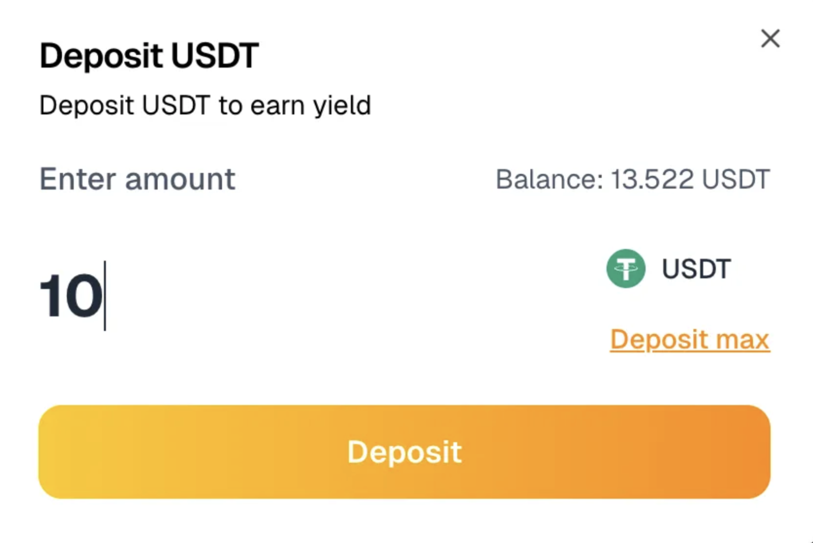

# OCUSD (USDT Yield Vault)

## Overview

The **USDT Vault** is a passive yield product by Solen Finance on EDUChain. Users deposit USDT and receive **OCUSD**, a yield-bearing stablecoin that appreciates over time based on real stablecoin yield strategies. All operations are handled by the Solen team, and users earn without needing to manage strategies themselves.

---

## How It Works

1. **Deposit USDT on EDUChain**
   - Users deposit USDT into the vault via the Solen frontend.
   - In return, they receive OCUSD, a token that represents their share in the vault.

2. **Yield Strategies Managed by Solen**
   - Solen deploys the USDT into stablecoin yield strategies on Arbitrum One.
   - Yield is harvested and bridged back to EDUChain to grow OCUSD value.

3. **Automatic Yield Accrual**
   - OCUSD is non-rebasing and increases in value over time.
   - No need to stake or claim — holding OCUSD is enough.

4. **Redemption Process**
   - Users initiate a cooldown via clicking the "Redeem" button.
   - After the cooldown period (default 15 days), they can claim USDT on EDUChain.

---

## Key Vault Parameters

| Parameter           | Value                                 |
| ------------------- | ------------------------------------- |
| Vault Token         | OCUSD                                 |
| Deposit Asset       | USDT                                  |
| Yield Source        | Stablecoin strategies on Arbitrum One |
| Strategy Manager    | Solen Finance                         |
| Cooldown Period     | default 15 days (epoch-based)         |
| Minting Fee         | 0%                                    |
| Redemption Fee      | 0.6%                                  |
| Redemption Location | EDUChain only                         |
| Contract Address    | `0x3C886065abf6E489071D0149b63d8EfD96906a7c` |

---

## Deposit Flow (Users)

- **Step 1**: Deposit USDT via the Solen frontend.

- **Step 2**: Receive OCUSD at current share price, minus any mint fee.
- **Step 3**: Start earning passive yield.

---

## Redemption Flow (Users)

- **Step 1**: Click the "Redeem" button to initiate the redeem process. 

- **Step 2**: Wait for cooldown period (default 15 days).

- **Step 2.5**: In this time, you can't request another redeem.

- **Step 3**: Call `claim()` to receive USDT on EDUChain.
- **Redemption Fee**: 0.6% of withdrawn amount.

---

## Risks

All vaults carry inherent risks. Key risks include:

- **Smart Contract Risk**: Bugs or exploits in Solen or third-party contracts.
- **Multisig Risk**: Assets are managed via a Solen-controlled multisig.
- **Strategy Risk**: Involves exposure to third-party protocols with potential for depeg, slippage, or insolvency.

Solen’s contracts have been audited, but audits do not eliminate all risk. 

**Audit Report from Certik is here:**  
[https://skynet.certik.com/projects/solen-finance](https://skynet.certik.com/projects/solen-finance)

---

## Go to App

- [App](https://app.solen.finance)
